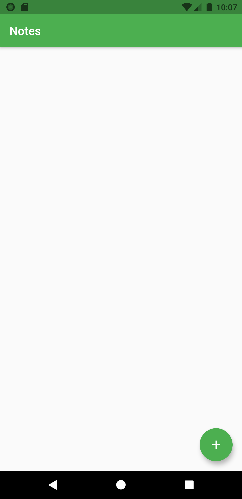
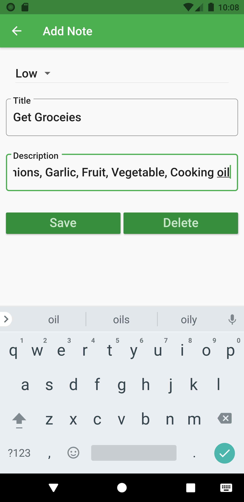
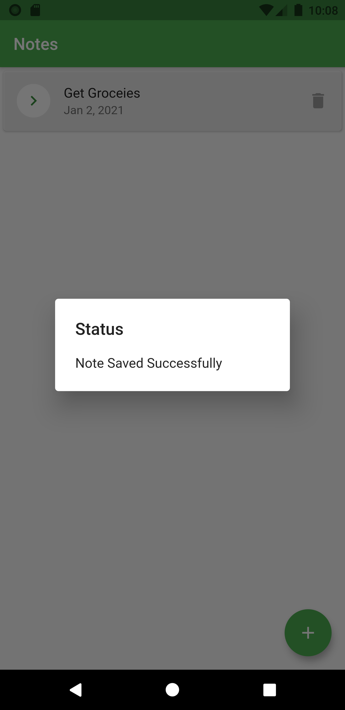
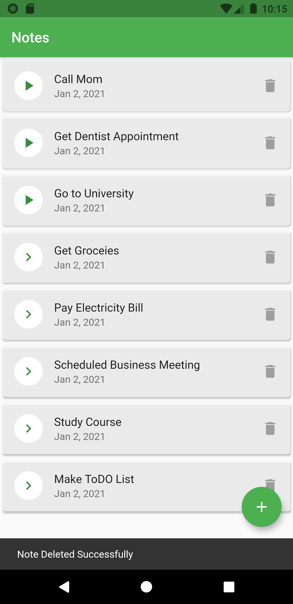
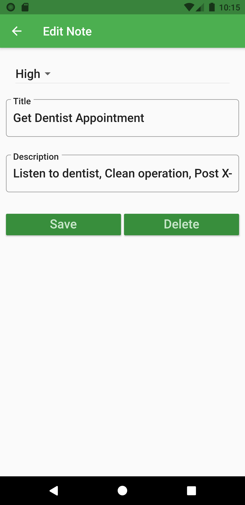

# To-Do List

A new Flutter application.
Steps
-----
 - Clone the project
 - Import in Android Studio or VS Code
 - Access repo from terminal.
 - Run the following commands: `flutter clean` , `flutter pub get`, `flutter run`.

## Getting Started

This project is a starting point for a Flutter application.

A few resources to get you started if this is your first Flutter project:

- [Lab: Write your first Flutter app](https://flutter.dev/docs/get-started/codelab)
- [Cookbook: Useful Flutter samples](https://flutter.dev/docs/cookbook)
todolist/test/
## Screenshot Meanu
 

## Screenshot Mark The List
 
 

For help getting started with Flutter, view our
[online documentation](https://flutter.dev/docs), which offers tutorials,
samples, guidance on mobile development, and a full API reference.
# todolist
